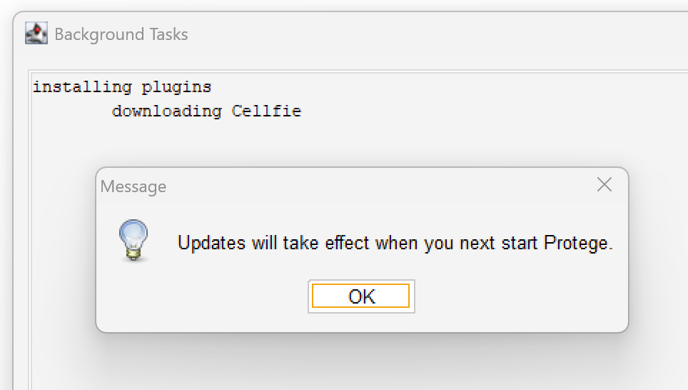

# Using Protégé

- [Using Protégé](#using-protégé)
  - ["Unable to check for plugins" Error](#unable-to-check-for-plugins-error)

## "Unable to check for plugins" Error

If you're "sitting" behind company firewall, when you want to check plugins in Protégé, you may get below error screen:


Error Message is as below:

```bash
Title: Unable to check for plugins
Message: Protégé could not connect to the plugin registry.
Reason: PKIX path building failed: sun.security.provider.certpath.SunCertPathBuilderException: unable to find valid certification path to requested target
```

My Protégé is version 5.6.9, installed in Windows 11 PC's path `C:\Program Files\Protege-5.6.9\`.

Analysis: This error message, specifically the `SunCertPathBuilderException`, usually indicates that the Java environment Protégé is running on doesn't trust the SSL certificate of the plugin registry. This is very common when working behind a corporate firewall or proxy that uses SSL inspection (`man-in-the-middle` decryption).

In my specific case, my system uses a custom root CA certificate, so below fix is to manually imporr that certificate into the Java TrustStore used by Protégé.

1. Identify the Java Runtime

Protégé normally comes with its own bundled Java Runtime Environment (JRE). Below is to find where it's located:

- Look in the Protégé installation folder for a directiory named `jre`
- If it's not there, Protégé is likely using your system's default Java (check your `JAVA_HOME` environment variable)

2. Export the Corporate Root Certificate

   1. Open your web browser (Chrome or Edge)
   2. Go to the URL the register is trying to hit (usually `https://protege.stanford.edu`)
   3. Check the **Padlock icon** in the address bar -> **Connection is secure** -> **Certificate is valid**.
   4. Go to the **Details** or **Certification Path** tab.
   5. Select the **Root Certificate** (the one at the very top of the hierarchy).
   6. Click **Export** or **Copy to File** and save it as a `.cer` or `crt` file (e.g. `company_root.cer`).

3. Import the Certificate into the KeyStore

Open a Command Prompt or Terminal as **Administrator** and run the `keytool` command. You will need to poin it to the `cacerts` file inside the Protégé JRE.

```bash
keytool -import -trustcacerts -alias corporate-root -file "C:\path\to\company_root.cer" -keystore "C:\path\to\Protege\jre\lib\security\cacerts"
```

- **Default Password**: The default password for the Java keystore is `changeit`.
- **Trust**: When asked "Trust this certificate?", tyep `yes`.

4. Alternative: Manual Plugin Installation

If you cannot bypass the proxy/SSL issues, you may download plugins manually:

    1. Visit the [Protégé Plugin Library](https://protege.stanford.edu/ontologies.php) in your browser.
    2. Download the `.jar` file for the plugin you need.
    3. Drop the file into the `plugins` folder inside your Protégé installation directory.
    4. Restart Protégé.

Quick Tip: If you are using a proxy, ensure your proxy settings are also configured within Protégé under **File > Preferences > Web Services**.

After this fix, you should be able to check and install the plugin updates, as below:



_Updated at: 2026-04-07_
